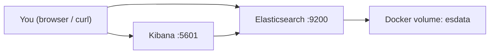

# SearchHub

Hybrid e-commerce search engine built on Elasticsearch 8.
Learning project: keyword search -> semantic search -> hybrid RRF -> RAG.

## Phase 0 - Current setup

- Elasticsearch 8.15 (port 9200)
- Kibana 8.15 (port 5601)

## Quick start

```bash
docker compose up -d
curl http://localhost:9200
open http://localhost:5601
```

## Architecture


